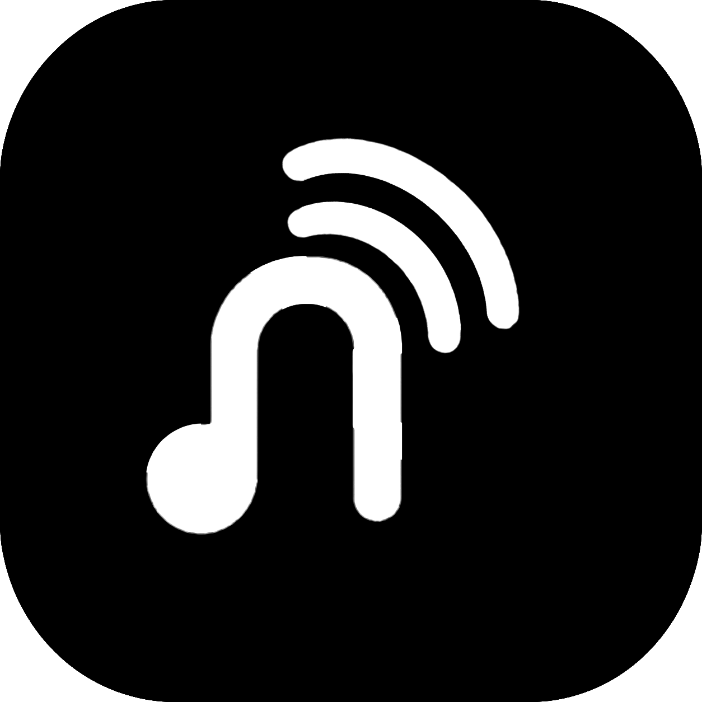

<div align="center">



# NofufAudio

**Hybrid, open-source music player for YouTube, Spotify and local files**

[](LICENSE)
[]()
[](https://www.electronjs.org/)

</div>

---

NofufAudio is a desktop music player that combines YouTube streaming, Spotify playlist importing, and local file playback in a single, clean interface. No subscriptions. No ads. Everything stays local.

---

## 📸 Screenshots

<div align="center">
  
  
  
  
</div>

## ✨ Features

### 🎵 Playback
- Play audio from **YouTube** (videos and playlists) directly — audio only, no video
- Play **local files**: MP3, FLAC, OGG, WAV, M4A, OPUS and more
- **Persistent queue** with shuffle and repeat (song / all)
- **Crossfade** between songs (configurable from 1 to 10 seconds)
- **Volume normalization** to even out louder and quieter songs
- Integration with **media keys** and the OS media session (lock screen controls, album art)

### 📥 Import
| Source | What you can import |
|---|---|
| **Local files** | Individual files or entire folders — metadata and cover art are read automatically |
| **YouTube URL** | Paste any video URL to add it to your library instantly |
| **YouTube playlist** | Paste a playlist URL — every song is imported with thumbnails |
| **Spotify playlist** | Paste a Spotify playlist URL — NofufAudio automatically finds the matching YouTube audio for each song |

### 🔍 Search
- Built-in **YouTube search** — find any song or video without leaving the app
- **Spotify catalog search** — search songs by name and add them to your library

### 💾 Download
- Download any **individual song** (from YouTube or local) to disk as MP3, M4A, OPUS or WEBM
- Download an **entire playlist** at once — resumes where you left off if you cancel
- Configurable **output folder** and **format** per session
- Real-time **download progress** panel with per-song status

### 📋 Library and Playlists
- Full **library** view with search and sorting
- Unlimited **custom playlists** — configurable name, cover, and song order
- **Favorites** system (heart button on any song)
- **Recently played** shelf on the home screen
- **Context menu** (right-click) on any song: edit info, add to playlist, play next, download, mark as favorite

### 🎛️ Audio effects — Nightcore panel
Dedicated effects panel with four presets and full manual control:

| Control | Range | What it does |
|---|---|---|
| **Speed** | 0.1× – 2.0× | Changes playback speed without affecting pitch |
| **Pitch** | −12 to +12 st | Raises or lowers the pitch independently of speed |
| **Treble boost** | adjustable | Adds the characteristic nightcore brightness |

Built-in presets: **Nightcore**, **Slowed**, **Vaporwave**, **Speed Up**

### 🎚️ Equalizer
- 10-band parametric EQ
- Built-in presets: Flat, Bass Boost, Treble Boost, Vocal, Electronic, Acoustic…
- Save and name your own **custom presets** (persist across sessions)
- Can be enabled/disabled without losing the settings

### 📊 Visualizer
- Full-screen audio visualizer (bars, wave, circle)
- Configurable color, sensitivity, shadow, and style
- Opens with one click, closes with the logo or the back button

### 🎤 Lyrics
- Automatic fetching of **synced lyrics** (karaoke-style, word-by-word highlighting)
- Falls back to unsynced lyrics
- Resizable lyrics panel with configurable font and size

### 🎨 Customization
Every visual aspect is adjustable from the theme panel:
- **Color theme** — 8 built-in presets (Dark, AMOLED, Midnight, Forest, Ocean, Rose, Light, Coffee) plus a full color picker for every UI element
- **Accent color** — quick selection or custom hex
- **Font family** — choose from the app's built-in fonts or any font installed on your system
- **Font size**, **border radius**, **border opacity**
- **Panel spacing**, **player height**, **modal background opacity**
- Export and import themes as JSON to share them

### 🖥️ System integration
- **Minimize to tray** and **close to tray** (configurable)
- System tray icon with context menu (Play/Pause, Next, Show, Quit)
- Support for a **background image** in the player
- Frameless window with a custom title bar

---

## 🚀 Installation

### Linux (Arch / CachyOS)

```bash
# 1. Download and extract the zip
unzip linux-portable-nofufaudio-1.4.1.zip
cd nofufaudio

# 2. Run the installer (no sudo needed — installs to ~/.local)
chmod +x install.sh
./install.sh
```

The installer takes care of:
- Checking for Node.js, Python and pip
- Running `npm install` automatically
- Downloading the latest `yt-dlp` binary for your architecture
- Installing `spotifyscraper` (needed to import Spotify playlists)
- Creating the `nofufaudio` command in `~/.local/bin`
- Registering the app in the desktop applications menu

To uninstall:
```bash
bash ~/.local/share/nofufaudio/install.sh --remove
```

### Windows

Run **NofufAudio Setup 1.0.0.exe**, or launch **NofufAudio.exe** from the portable version.

---

## 📦 Dependencies

| Dependency | Needed for |
|---|---|
| **Node.js ≥ 18** | Running the app |
| **yt-dlp** | YouTube streaming and downloading (the installer downloads it automatically) |
| **Python 3** | Importing Spotify playlists |
| **spotifyscraper** (pip) | Importing Spotify playlists |
| **music-metadata** (npm) | Reading metadata from local audio files |

---

<br>

---

<div align="center">


# NofufAudio

**Reproductor de música híbrido y de código abierto para YouTube, Spotify y archivos locales**

[](LICENSE)
[]()
[](https://www.electronjs.org/)

</div>

---

NofufAudio es un reproductor de música de escritorio que combina streaming de YouTube, importación de playlists de Spotify y reproducción de archivos locales en una sola interfaz limpia. Sin suscripciones. Sin anuncios. Todo se queda en local.

---

## 📸 Capturas

<div align="center">
  
  
  
  
</div>

## ✨ Funcionalidades

### 🎵 Reproducción
- Reproduce audio de **YouTube** (vídeos y playlists) directamente — sin vídeo, solo audio
- Reproduce **archivos locales**: MP3, FLAC, OGG, WAV, M4A, OPUS y más
- **Cola persistente** con shuffle y repeat (canción / todo)
- **Crossfade** entre canciones (configurable de 1 a 10 segundos)
- **Normalización de volumen** para igualar canciones más altas y más bajas
- Integración con **teclas multimedia** y la sesión de medios del sistema operativo (controles en pantalla de bloqueo, portada del álbum)

### 📥 Importar
| Origen | Qué puedes importar |
|---|---|
| **Archivos locales** | Archivos sueltos o carpetas enteras — metadata y portada se leen automáticamente |
| **URL de YouTube** | Pega cualquier URL de vídeo para añadirlo a tu biblioteca al instante |
| **Playlist de YouTube** | Pega una URL de playlist — todas las canciones se importan con miniaturas |
| **Playlist de Spotify** | Pega una URL de playlist de Spotify — NofufAudio busca automáticamente el audio de YouTube correspondiente a cada canción |

### 🔍 Búsqueda
- **Buscador de YouTube** integrado — encuentra cualquier canción o vídeo sin salir de la app
- **Búsqueda en el catálogo de Spotify** — busca canciones por nombre y añádelas a tu biblioteca

### 💾 Descargar
- Descarga cualquier **canción individual** (de YouTube o local) a tu disco en MP3, M4A, OPUS o WEBM
- Descarga una **playlist entera** de una vez — retoma donde lo dejaste si cancelas
- **Carpeta de salida** y **formato** configurables por sesión
- Panel de **progreso de descarga** en tiempo real con estado por canción

### 📋 Biblioteca y Playlists
- Vista de **biblioteca** completa con búsqueda y orden
- **Playlists personalizadas** ilimitadas — nombre, portada y orden de canciones configurables
- Sistema de **favoritos** (botón de corazón en cualquier canción)
- Estante de **reproducidas recientemente** en la pantalla de inicio
- **Menú contextual** (clic derecho) en cualquier canción: editar información, añadir a playlist, reproducir siguiente, descargar, marcar favorito

### 🎛️ Efectos de audio — Panel Nightcore
Panel de efectos dedicado con cuatro presets y control manual completo:

| Control | Rango | Qué hace |
|---|---|---|
| **Velocidad** | 0.1× – 2.0× | Cambia la velocidad de reproducción sin afectar al tono |
| **Pitch** | −12 a +12 st | Sube o baja el tono de forma independiente a la velocidad |
| **Realce de agudos** | ajustable | Añade el brillo característico del nightcore |

Presets incluidos: **Nightcore**, **Slowed**, **Vaporwave**, **Speed Up**

### 🎚️ Ecualizador
- EQ paramétrico de 10 bandas
- Presets integrados: Plano, Bass Boost, Treble Boost, Vocal, Electrónica, Acústica…
- Guarda y nombra tus propios **presets personalizados** (se conservan entre sesiones)
- Activable/desactivable sin perder la configuración

### 📊 Visualizador
- Visualizador de audio a pantalla completa (barras, onda, círculo)
- Color, sensibilidad, sombra y estilo configurables
- Se abre con un clic, se cierra con el logo o el botón de atrás

### 🎤 Letras
- Obtención automática de **letras sincronizadas** (estilo karaoke, resaltado palabra a palabra)
- Fallback a letras no sincronizadas
- Panel de letras redimensionable, fuente y tamaño configurables

### 🎨 Personalización
Cada aspecto visual es ajustable desde el panel de temas:
- **Tema de color** — 8 presets integrados (Dark, AMOLED, Midnight, Forest, Ocean, Rose, Light, Coffee) más selector de color completo para cada elemento de la interfaz
- **Color de acento** — selección rápida o hex personalizado
- **Familia de fuente** — elige entre las fuentes de la app o cualquier fuente instalada en tu sistema
- **Tamaño de fuente**, **radio de bordes**, **opacidad de bordes**
- **Separación entre paneles**, **altura del reproductor**, **opacidad del fondo de modales**
- Exporta e importa temas en JSON para compartirlos

### 🖥️ Integración con el sistema
- **Minimizar a la bandeja** y **cerrar a la bandeja** (configurable)
- Icono en la bandeja del sistema con menú contextual (Play/Pausa, Siguiente, Mostrar, Salir)
- Soporte para **imagen de fondo** en el reproductor
- Ventana sin marco con barra de título personalizada

---

## 🚀 Instalación

### Linux (Arch / CachyOS)

```bash
# 1. Descarga y extrae el zip
unzip linux-portable-nofufaudio-1.4.1.zip
cd nofufaudio

# 2. Ejecuta el instalador (no necesita sudo — instala en ~/.local)
chmod +x install.sh
./install.sh
```

El instalador se encarga de:
- Comprobar Node.js, Python y pip
- Ejecutar `npm install` automáticamente
- Descargar el binario de `yt-dlp` más reciente para tu arquitectura
- Instalar `spotifyscraper` (necesario para importar playlists de Spotify)
- Crear el comando `nofufaudio` en `~/.local/bin`
- Registrar la app en el menú de aplicaciones del escritorio

Para desinstalar:
```bash
bash ~/.local/share/nofufaudio/install.sh --remove
```

### Windows

Ejecuta **NofufAudio Setup 1.0.0.exe** o lanza **NofufAudio.exe** desde la versión portable.

---

## 📦 Dependencias

| Dependencia | Necesaria para |
|---|---|
| **Node.js ≥ 18** | Ejecutar la app |
| **yt-dlp** | Streaming y descarga de YouTube (el instalador lo descarga automáticamente) |
| **Python 3** | Importar playlists de Spotify |
| **spotifyscraper** (pip) | Importar playlists de Spotify |
| **music-metadata** (npm) | Leer metadata de archivos de audio locales |

---
